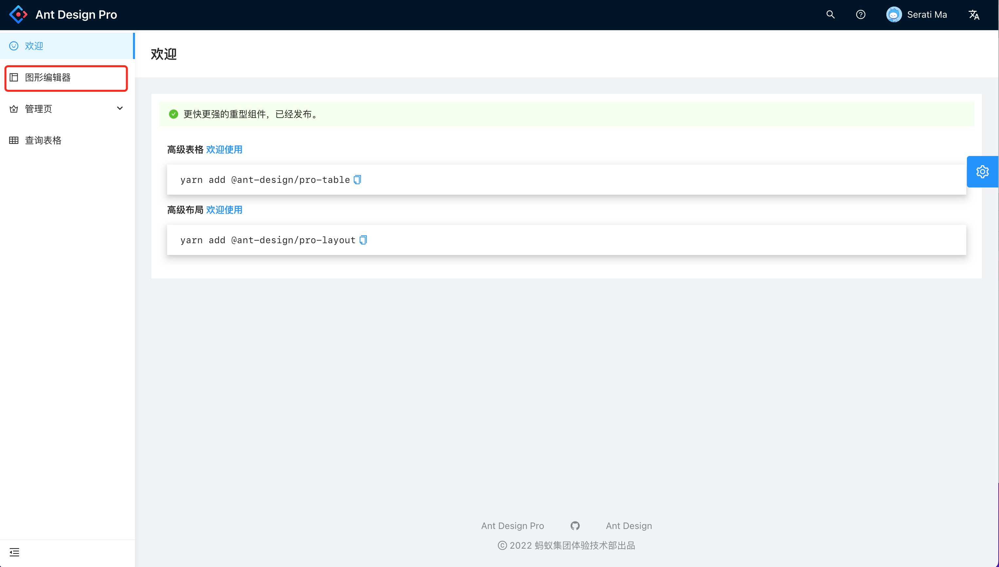
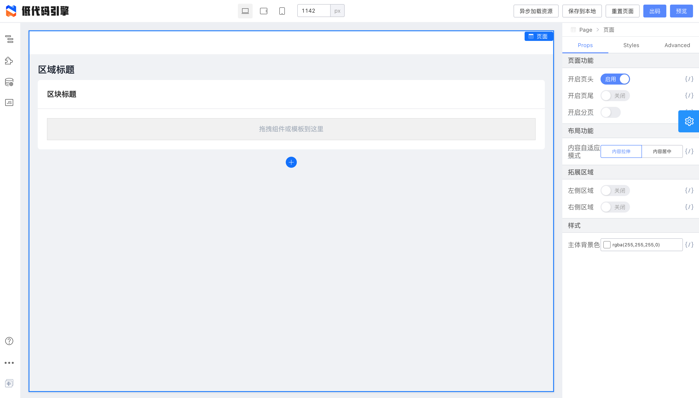

# LowcodeEngine-AntDesignPro
阿里巴巴开源的低代码引擎(Lowcode-Engine)与Ant Design Pro v5整合的Demo。  

阿里巴巴开源了一个低代码引擎(Lowcode-Engine)，同时也放出了Demo，于是就尝试将Lowcode-Engine整合进了Ant Design Pro v5。  

阿里开源项目的文档对新手不友好的名声在业界也是响当当的（TMD!）。

## Environment Prepare

Install `node_modules`:

```bash
npm install
```

or

```bash
yarn
```

## Provided Scripts

Ant Design Pro provides some useful script to help you quick start and build with web project, code style check and test.

Scripts provided in `package.json`. It's safe to modify or add additional script:

### Start project

```bash
npm start
```

### Build project

```bash
npm run build
```

### Check code style

```bash
npm run lint
```

You can also use script to auto fix some lint error:

```bash
npm run lint:fix
```

### Test code

```bash
npm test
```

### 截图  





#### 公众号  
更多信息发布于公众号：代码乾坤 (CoderLand)  
公众号是否关注无所谓，它只是一个信息发布和沟通的渠道。  
如果您认为这些信息对您的朋友也有用，请转发给他们。  


